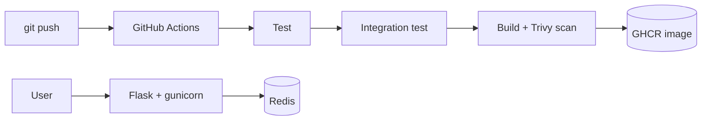

# devops-showcase


Flask + Redis app with a full CI/CD pipeline: automated tests, integration test on the real Docker Compose stack, vulnerability scanning, and image publishing to GitHub Container Registry.

## Architecture



## Features

- Flask API served by gunicorn, running as a non-root user
- `/health` endpoint and Prometheus `/metrics` endpoint
- Docker healthchecks and auto-restart; the app waits for Redis to be healthy
- CI/CD on every push: pytest, Compose smoke test, Trivy scan, push to GHCR

## Run locally

```bash
docker compose up --build -d
curl localhost:5000
curl localhost:5000/health
```

## Run tests

```bash
python3 -m venv venv && source venv/bin/activate
pip install -r requirements-dev.txt
pytest -v
```

## Image

```bash
docker pull ghcr.io/alibhae89-gif/devops-showcase:latest
```
